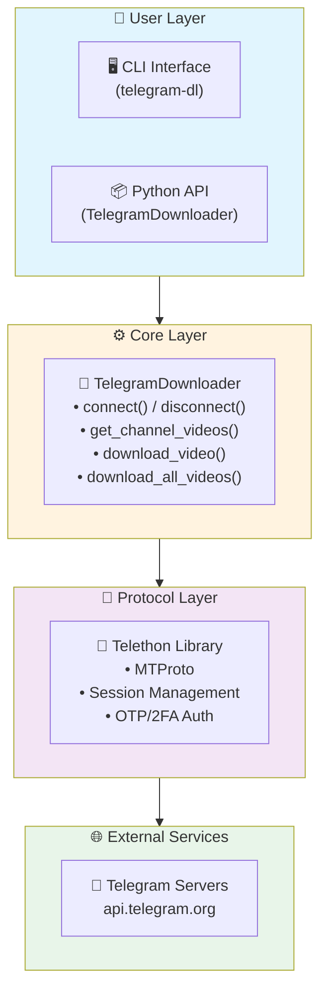
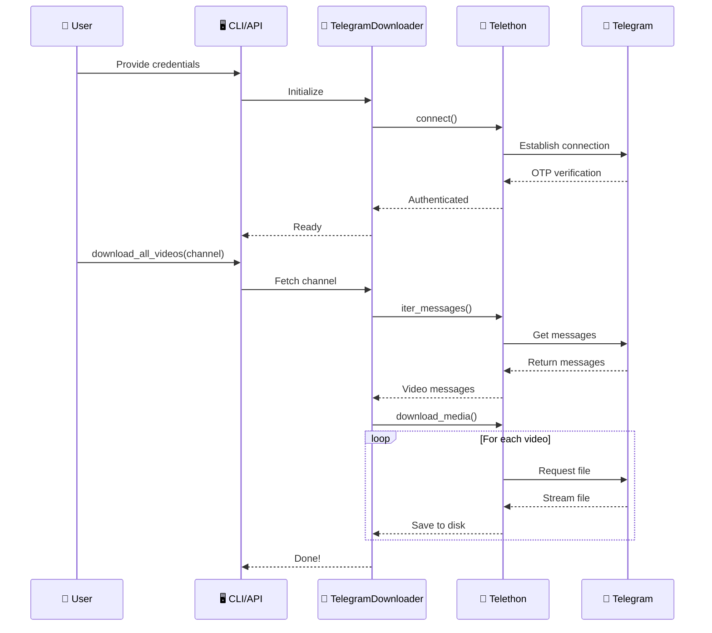
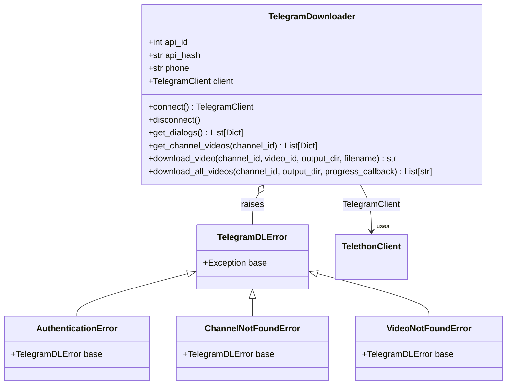
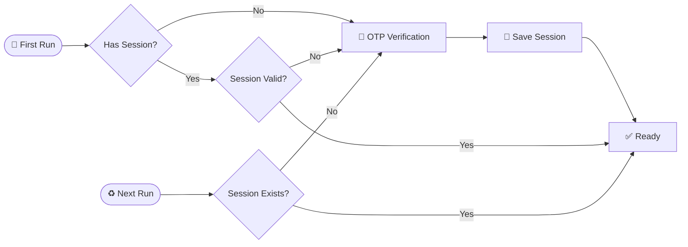
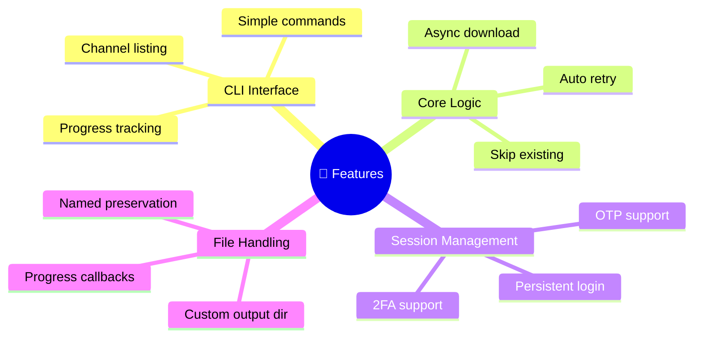

# telegram-dl

A Python CLI tool to download videos from Telegram channels.

## Installation

```bash
pip install telegram-dl
```

## Quick Start

### 1. Get Telegram API Credentials

1. Go to [my.telegram.org](https://my.telegram.org)
2. Log in with your phone number
3. Click **"API development tools"**
4. Create a new app
5. Copy your **API ID** and **API Hash**

### 2. Download Videos

```bash
# List your channels first
telegram-dl --api-id 12345 --api-hash abc123def456 --phone +1234567890 --list-channels

# Download all videos from a channel
telegram-dl --api-id 12345 --api-hash abc123def456 --phone +1234567890 --channel -1001234567890
```

### 3. Use Custom Output Directory

```bash
telegram-dl --api-id 12345 --api-hash abc123def456 --phone +1234567890 --channel -1001234567890 --output ./my_videos
```

## Programmatic Usage

```python
from telegram_dl import TelegramDownloader

async def main():
    async with TelegramDownloader(
        api_id=12345,
        api_hash="abc123def456",
        phone="+1234567890"
    ) as dl:
        # List channels
        async for dialog in dl.client.iter_dialogs():
            if dialog.is_channel:
                print(f"{dialog.id} | {dialog.title}")
        
        # Download all videos
        await dl.download_all_videos(channel_id, "./videos")

asyncio.run(main())
```

## High Level Design (HLD)

### Architecture



### Data Flow



### Class Diagram



### Session Management Flow



### Error Handling

```mermaid
flowchart TB
    E[❌ Error Occurs] --> A
    
    subgraph TelethonErrors
        A1["🔴 ConnectionError"]
        A2["🔴 SessionPasswordNeededError"]
        A3["🔴 ChannelInvalidError"]
    end
    
    subgraph CustomErrors
        B1["🟠 TelegramDLError (base)"]
        B2["🟠 AuthenticationError"]
        B3["🟠 ChannelNotFoundError"]
        B4["🟠 VideoNotFoundError"]
    end
    
    subgraph Handling
        C1["📋 User retries with valid creds"]
        C2["📋 Check channel ID"]
        C3["📋 Verify video exists"]
    end
    
    A1 --> B1
    A2 --> B2
    A3 --> B3
    
    B1 <|-- B2
    B1 <|-- B3
    B1 <|-- B4
    
    B2 --> C1
    B3 --> C2
    B4 --> C3
    
    style TelethonErrors fill:#ffebee
    style CustomErrors fill:#fff8e1
    style Handling fill:#e8f5e9
```

### Components

| Component | Responsibility |
|-----------|---------------|
| `cli.py` | Command-line interface, argument parsing |
| `client.py` | Core download logic, Telegram client management |
| `exceptions.py` | Custom exception classes |

### Key Features



## Features

- Download all videos from Telegram channels
- Automatic session management (login once, use many times)
- Progress tracking
- Named file preservation from Telegram
- Skip already downloaded files
- CLI and programmatic API

## Requirements

- Python 3.10+
- Telegram API credentials (get from [my.telegram.org](https://my.telegram.org))

## License

MIT License
